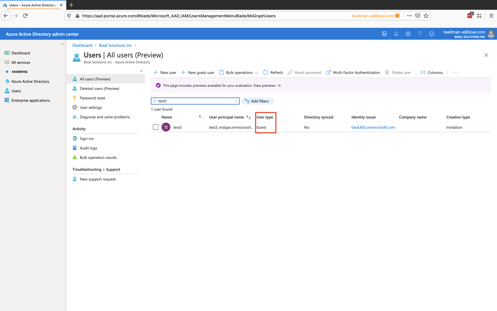
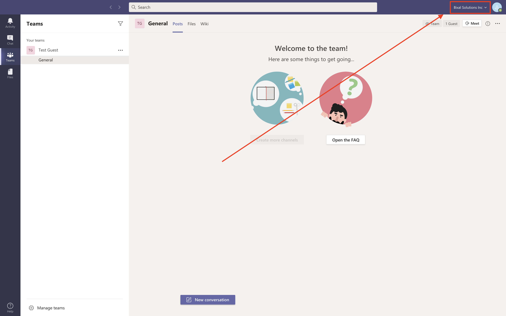

# Microsoft Guest

This page documents Bixal's policy for adding external (guest) users to Microsoft 365.

## Policy
External users (non `@bixal.com` email addresses) may be added to a particular Microsoft 365 group. Once the external user is added to the group, they will have access to the corresponding SharePoint site and Microsoft Teams channels. The external user will **not** be able to search or view other internally-public Microsoft 365 groups.

## Identity provider
The external user will continue to use their existing identity provider. In Bixal's Azure AD, the external user will be listed as a guest user as shown in the screenshot below.

* 

## User interface
In Microsoft Teams, the user will need to click the organization dropdown in the upper right corner to switch the **Bixal Solutions Inc** view. The user will only view channels and chats that they have access to at Bixal.

* 
